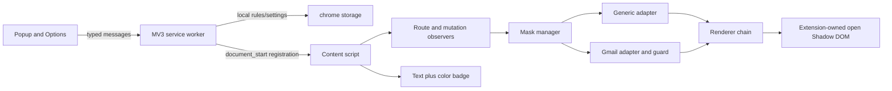

# Final architecture diagram

```mermaid
flowchart LR
  Popup[Popup and Options] -->|typed messages| SW[MV3 service worker]
  SW -->|local rules/settings| Storage[chrome storage]
  SW -->|document_start registration| Content[Content script]
  Content --> Route[Route and mutation observers]
  Route --> Manager[Mask manager]
  Manager --> Generic[Generic adapter]
  Manager --> Gmail[Gmail adapter and guard]
  Generic --> Renderers[Renderer chain]
  Gmail --> Renderers
  Renderers --> Root[Extension-owned open Shadow DOM]
  Content --> Badge[Text plus color badge]
```

All arrows remain inside the browser. No application data is sent to a remote service.
